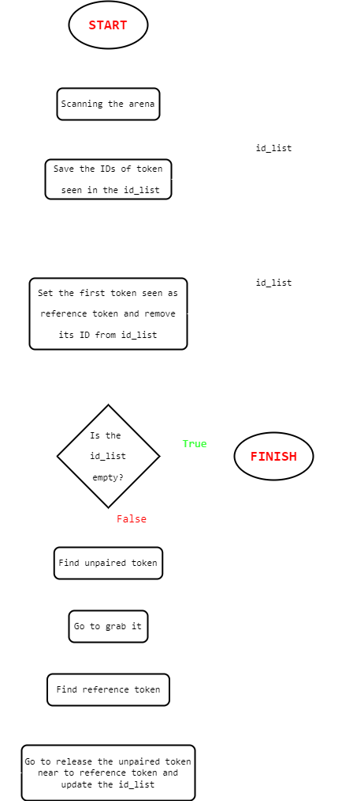

Python Robotics Simulator
================================

This is a simple, portable robot simulator developed by [Student Robotics](https://studentrobotics.org).
Some of the arenas and the exercises have been modified for the Research Track I course

Installing and running
----------------------

The simulator requires a Python 2.7 installation, the [pygame](http://pygame.org/) library, [PyPyBox2D](https://pypi.python.org/pypi/pypybox2d/2.1-r331), and [PyYAML](https://pypi.python.org/pypi/PyYAML/).

Pygame, unfortunately, can be tricky (though [not impossible](http://askubuntu.com/q/312767)) to install in virtual environments. If you are using `pip`, you might try `pip install hg+https://bitbucket.org/pygame/pygame`, or you could use your operating system's package manager. Windows users could use [Portable Python](http://portablepython.com/). PyPyBox2D and PyYAML are more forgiving, and should install just fine using `pip` or `easy_install`.

## Troubleshooting

When running `python run.py <file>`, you may be presented with an error: `ImportError: No module named 'robot'`. This may be due to a conflict between sr.tools and sr.robot. To resolve, symlink simulator/sr/robot to the location of sr.tools.

On Ubuntu, this can be accomplished by:
* Find the location of srtools: `pip show sr.tools`
* Get the location. In my case this was `/usr/local/lib/python2.7/dist-packages`
* Create symlink: `ln -s path/to/simulator/sr/robot /usr/local/lib/python2.7/dist-packages/sr/`

## Assignment
-----------------------------

The assignment consist in write a python node that controls the robot to put all the golden boxes together.

You can run the program with:

```bash
$ python2 run.py assignment.py
```

My personal implementation has the following steps:
1. Count how many tokens there are in the arena and put their IDs in a list.
2. Set as reference token the first token seen and save its ID.
3. Search the unpaired token and grab it.
4. Find the reference token.
5. Release the unpaired token near to reference token.
6. Repeat 3-5 steps until there are no more unpaired tokens.

In flowchart terms as below:
<div align="center">
  
</div>


## Functions implemented

### count_token():
  Function to count how many tokens there are in arena and save their IDs in a list.
  The first token seen it will be the reference token.
 
### find_unpaired_token():
  Function to find unpaired token and then go to grab it. When the unpaired token will be released near the reference token, it removes the ID of the newly released token from the id_list.
### find_reference_token():
  Function to find the reference token after unpaired token grabbed and bring it close to reference token.

## Notes

To read better what the robot does, I added a simple delay between actions to avoid annoying motion messages. To see how the program behaves without delay set the global variable `delay = 0`.

I could reduce the speeds and seconds of drive() and turn() functions but the robot would be too slow.
One of the task of the assignment doesn't include the time to reach the goal, but i preferred to speed up the robot.

## Possible improvements

One of the possible improvements that can be made is definitely to bring each token close to one of the already paired tokens, this is to prevent the robot from bumping into the paired tokens that are in between the robot and the reference token. It can be implemented by creating a list for the paired tokens and then modifying the `find_reference_token()` function so that it only searches for already paired tokens.
  
Robot API
---------

The API for controlling a simulated robot is designed to be as similar as possible to the [SR API][sr-api].

### Motors ###

The simulated robot has two motors configured for skid steering, connected to a two-output [Motor Board](https://studentrobotics.org/docs/kit/motor_board). The left motor is connected to output `0` and the right motor to output `1`.

The Motor Board API is identical to [that of the SR API](https://studentrobotics.org/docs/programming/sr/motors/), except that motor boards cannot be addressed by serial number. So, to turn on the spot at one quarter of full power, one might write the following:

```python
R.motors[0].m0.power = 25
R.motors[0].m1.power = -25
```

### The Grabber ###

The robot is equipped with a grabber, capable of picking up a token which is in front of the robot and within 0.4 metres of the robot's centre. To pick up a token, call the `R.grab` method:

```python
success = R.grab()
```

The `R.grab` function returns `True` if a token was successfully picked up, or `False` otherwise. If the robot is already holding a token, it will throw an `AlreadyHoldingSomethingException`.

To drop the token, call the `R.release` method.

Cable-tie flails are not implemented.

### Vision ###

To help the robot find tokens and navigate, each token has markers stuck to it, as does each wall. The `R.see` method returns a list of all the markers the robot can see, as `Marker` objects. The robot can only see markers which it is facing towards.

Each `Marker` object has the following attributes:

* `info`: a `MarkerInfo` object describing the marker itself. Has the following attributes:
  * `code`: the numeric code of the marker.
  * `marker_type`: the type of object the marker is attached to (either `MARKER_TOKEN_GOLD`, `MARKER_TOKEN_SILVER` or `MARKER_ARENA`).
  * `offset`: offset of the numeric code of the marker from the lowest numbered marker of its type. For example, token number 3 has the code 43, but offset 3.
  * `size`: the size that the marker would be in the real game, for compatibility with the SR API.
* `centre`: the location of the marker in polar coordinates, as a `PolarCoord` object. Has the following attributes:
  * `length`: the distance from the centre of the robot to the object (in metres).
  * `rot_y`: rotation about the Y axis in degrees.
* `dist`: an alias for `centre.length`
* `res`: the value of the `res` parameter of `R.see`, for compatibility with the SR API.
* `rot_y`: an alias for `centre.rot_y`
* `timestamp`: the time at which the marker was seen (when `R.see` was called).

For example, the following code lists all of the markers the robot can see:

```python
markers = R.see()
print "I can see", len(markers), "markers:"

for m in markers:
    if m.info.marker_type in (MARKER_TOKEN_GOLD, MARKER_TOKEN_SILVER):
        print " - Token {0} is {1} metres away".format( m.info.offset, m.dist )
    elif m.info.marker_type == MARKER_ARENA:
        print " - Arena marker {0} is {1} metres away".format( m.info.offset, m.dist )
```

[sr-api]: https://studentrobotics.org/docs/programming/sr/
